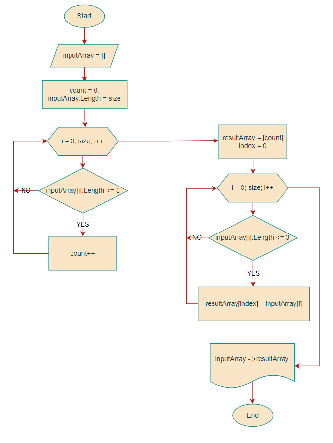

Задача алгоритмически не самая сложная, однако для полноценного выполнения проверочной работы необходимо:

1. Создать репозиторий на GitHub
2. Нарисовать блок-схему алгоритма (можно обойтись блок-схемой основной содержательной части, если вы выделяете её в отдельный метод)
3. Снабдить репозиторий оформленным текстовым описанием решения (файл README.md)
4. Написать программу, решающую поставленную задачу
5. Использовать контроль версий в работе над этим небольшим проектом (не должно быть так, что всё залито одним коммитом, как минимум этапы 2, 3, и 4 должны быть расположены в разных коммитах)

Задача: Написать программу, которая из имеющегося массива строк формирует новый массив из строк, длина которых меньше, либо равна 3 символам. Первоначальный массив можно ввести с клавиатуры, либо задать на старте выполнения алгоритма. При решении не рекомендуется пользоваться коллекциями, лучше обойтись исключительно массивами.

Примеры:
[“Hello”, “2”, “world”, “:-)”] → [“2”, “:-)”]
[“1234”, “1567”, “-2”, “computer science”] → [“-2”]
[“Russia”, “Denmark”, “Kazan”] → []

## Решение и пояснения
## Ссылка на GitHub: https://github.com/MrsStasya/ControlWorkBasicBlock
## Блок-схема.

## Описание решения
1. Запросим у пользователя ввод элементов массива через пробел и считаем, введенные пользователем элементы
Console.WriteLine("Введите элементы массива через пробел:");
string input = Console.ReadLine();
2. Создадим массив, содержащий все элементы, введенные пользователем. 
    string[] inputArray = input.Split(new[] { ' ' },StringSplitOptions.RemoveEmptyEntries);
    Для удаления пустот будем использовать StringSplitOptions.RemoveEmptyEntries. ТЭта конструкция также необходима, чтобы удалить случайно нажатые несколько раз пробелы.

3. Далее произведем подсчет количества символов в каждом элементе массива.
Введем count - счетчик
С помощью цикла for проходимся по всем элементам массива
в цикле if проверяем каждый элемент на соотвествие условий задачи(элементы не должны превышать 3х символов)
    int count = 0; 
    for (int i = 0; i < inputArray.Length; i++)
    {
        if (inputArray[i].Length <= 3)
        {
            count++;
        }
    }
4. Создаем новый массив, содержащий только те элементы длинна которых меньше или равна 3.
    string[] resultArray = new string[count];
    int index = 0; 
    for (int i = 0; i < inputArray.Length; i++)
    {
        if (inputArray[i].Length <= 3)
        {
            resultArray[index] = inputArray[i];
            index++;
        }
    }
5. Выведем полученный массив на экран
inputOutput - переменная для вывода изначального массива.
resultOutput - переменная для вывода конечного массива.
    string inputOutput = string.Join("\", \"", inputArray);
    string resultOutput = string.Join("\", \"", resultArray);
    Console.WriteLine($"[\"{inputOutput}\"] -> [\"{resultOutput}\"]");

